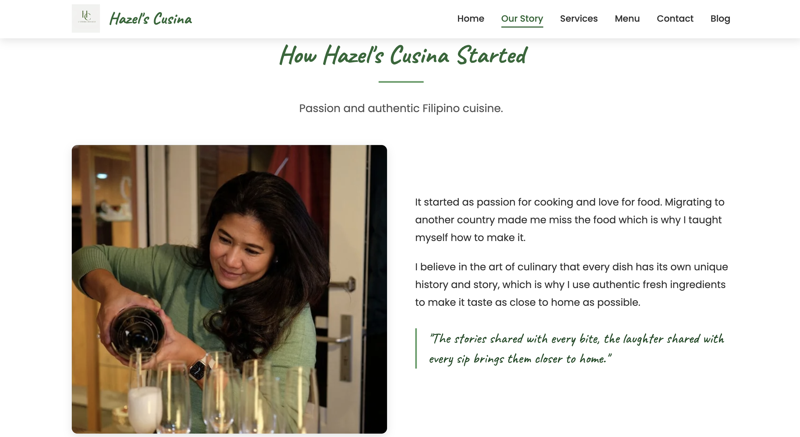
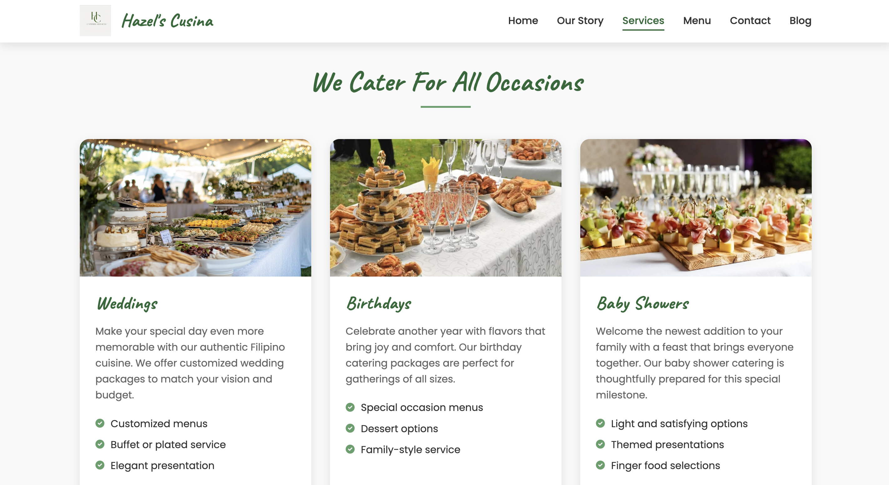
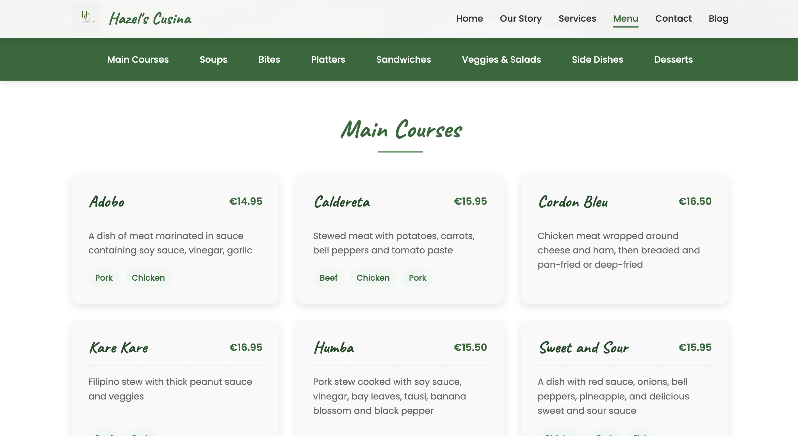
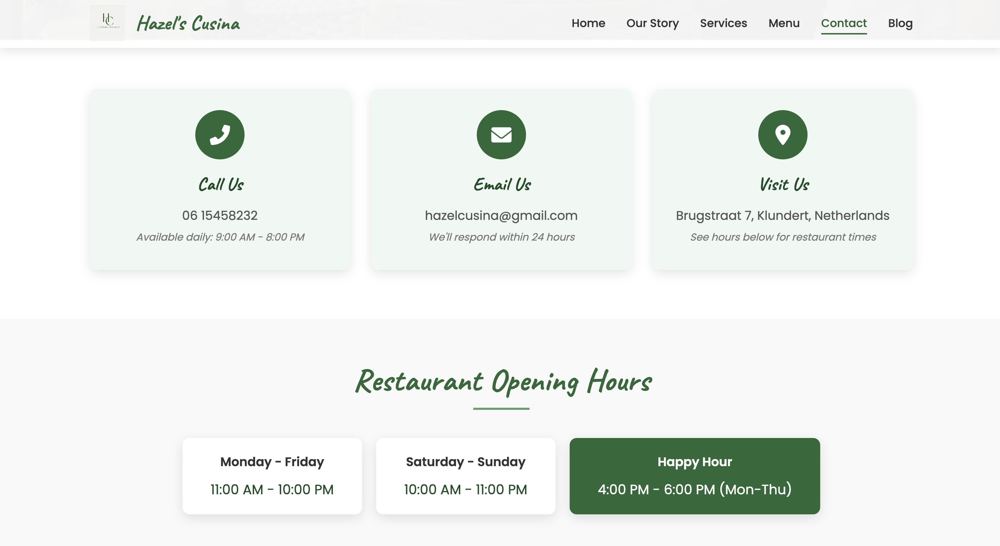
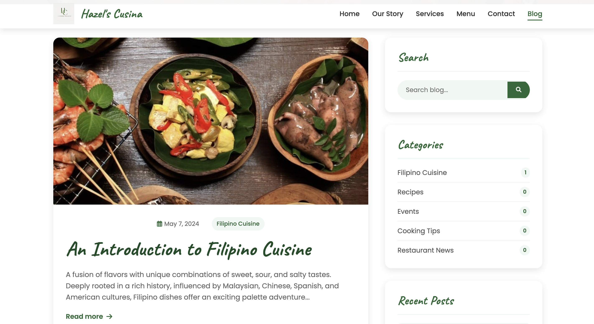

# Hazel's Cusina - Authentic Filipino Restaurant Website

A website for **Hazel's Cusina**, an Filipino restaurant and catering service based in *Klundert, Netherlands*. This fully responsive website serves as a digital storefront showcasing the restaurant's cuisine, services, and Filipino culinary culture.

## Live Website

Visit Hazel's Cusina at [noahlinker.nl](https://noahlinker.nl)

## Project Overview

This is a personal project with no real intention behind it. Currently, the website offers information about the cuisine, services, and makes it easy for customers to make reservations or request catering services.

## Technologies Used

- **Frontend**:
  - HTML5
  - CSS3 with responsive design principles
  - JavaScript (vanilla)
  - Font Awesome 6.0 for icons
  - Google Fonts for typography

- **Backend**:
  - Vercel serverless functions
  - Nodemailer for email processing
  
- **Deployment & Infrastructure**:
  - Vercel hosting platform
  - Vercel Analytics for visitor tracking
  - Code obfuscation for security
  
- **External Integrations**:
  - Google Maps API
  - Social media links (Facebook, Instagram)

## Website Structure

### 1. Home Page (`index.html`)

- Hero section with background video
- Introduction to Chef Hazel and restaurant philosophy
- Dynamic carousel showcasing signature dishes
- Customer testimonials section
- Facebook post integration
- Call-to-action for reservations

### 2. About Page (`about.html`)

- Restaurant origin story and journey
- Chef Hazel's background and culinary philosophy
- Core values with visual representations
- Restaurant statistics and achievements
- Customer testimonial highlight

### 3. Services Page (`services.html`)

- Comprehensive catering services information
- Event types (weddings, birthdays, corporate, etc.)
- Three-tiered catering packages with pricing
- Detailed process explanation for catering
- Restaurant location and hours

### 4. Menu Page (`menu.html`)

- Complete food offerings by category
- Interactive navigation between menu sections
- Detailed dish descriptions and pricing
- Special options and variations
- Downloadable PDF menu option

### 5. Contact Page (`contact.html`)

- Restaurant reservation form with serverless backend
- Catering inquiry form with email notifications
- Interactive Google Maps integration
- Business hours and contact information
- Frequently asked questions section

### 6. Blog Section (`blog.html` & `blog-post.html`)

- Articles about Filipino cuisine and culture
- Detailed post about Filipino culinary traditions
- Related content suggestions
- Newsletter signup functionality
- Social sharing capabilities

## Key Features & Functionality

### 1. Responsive Design
- Mobile-first approach ensuring seamless experience across all devices
- Hamburger menu for mobile navigation
- Optimized images and content layouts for different screen sizes

### 2. Interactive Elements
- Dish carousel with navigation controls
- Expandable FAQ accordion
- Form validation with immediate feedback
- Smooth scrolling navigation

### 3. Booking System
- Online table reservation with date/time selection
- Time restrictions based on restaurant opening hours
- Date validation to prevent past bookings
- Confirmation emails for reservations

### 4. Catering Requests
- Detailed catering inquiry form
- Package selection options
- Budget and guest count inputs
- Confirmation emails with event details

### 5. Email Integration
- Serverless functions handling form submissions
- Professional HTML email templates
- Automatic confirmations to customers
- Detailed notification emails to restaurant staff

### 6. Search Engine Optimization
- Comprehensive meta tags for improved visibility
- Semantic HTML structure
- Canonical URLs to prevent duplicate content
- Open Graph tags for social media sharing

### 7. Performance & Security
- Minified CSS and JavaScript
- Code obfuscation for protection
- Clean URLs without file extensions
- Optimized image loading

## Backend Implementation

The website uses Vercel serverless functions to handle form submissions:

- `api/reservation.js` - Processes table reservation requests
- `api/catering.js` - Handles catering inquiries

Both functions use Nodemailer to send professional HTML emails to both the restaurant and the customer, providing a seamless booking experience.

## Analytics & Tracking

The site implements Vercel Analytics to track user behavior and site performance. This lightweight analytics solution is built into the Vercel platform and provides valuable insights on page views, user flow, and engagement without compromising user privacy.

## Build Process

The website uses an automated build process when deploying to Vercel:

1. JavaScript obfuscation for security
2. CSS minification for faster loading
3. HTML minification for improved performance
4. API preparation for serverless functions

Configuration is managed through `vercel.json` and `package.json` files.

## Domain & Hosting

The website is hosted on Vercel with clean URL configuration:
- Domain: noahlinker.nl
- Clean URLs (no .html extensions)
- Custom redirects for improved user experience

## Social Media Integration

- Facebook: [facebook.com/hazelscusina](https://www.facebook.com/hazelscusina)
- Instagram: [instagram.com/hazels_cusina](https://www.instagram.com/hazels_cusina)

## Future Enhancements

Potential future improvements include:
- Online ordering system
- Menu item filtering by dietary preferences
- Customer account creation
- Recipe sharing portal
- Integration with reservation platforms
- Multi-language support (Dutch/English)

## Contact Information

- **Location**: Brugstraat 7, Klundert, Netherlands
- **Phone**: 06 15458232
- **Email**: hazelcusina@gmail.com
- **Hours**: Monday-Friday 11am-10pm, Saturday-Sunday 10am-11pm

## About the Developer

I created this website as a personal project to enhance my web development skills.

- **Name**: Noah Linker
- **Education**: Software Development student at Grafisch Lyceum Rotterdam
- **Age**: 16 years old
- **Contact**: [noahlinker1@gmail.com](mailto:noahlinker1@gmail.com)

This website was developed exclusively for Hazel's Cusina and serves as a portfolio piece demonstrating my abilities in responsive design, front-end development, and serverless function implementation.

## License

© 2025 Hazel's Cusina. All rights reserved.

---

*This website was developed for Hazel's Cusina to create an online presence that reflects the warmth and authenticity of their Filipino cuisine and catering services.*